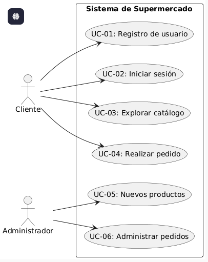
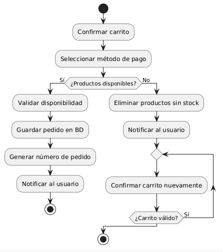

# Especificación de casos de uso

---

## UC-01: Registro de usuario
- **ID:** UC-01  
- **Nombre:** Registro de usuario  
- **Actor primario:** Cliente  
- **Interesados:** Cliente (acceso a la app), Administrador (gestión de usuarios)  
- **Precondiciones:** El cliente no debe estar registrado previamente.  
- **Postcondiciones (éxito):** Usuario registrado, cuenta activa 
- **Postcondiciones (fallo):** Mensaje de error indicando datos inválidos o usuario ya registrado.  

**Flujo principal:**  
1. El cliente selecciona “Registrarse”.  
2. Ingresa nombre, apellido, usuario y contraseña.  
3. El sistema valida formato de datos.  
4. Se almacena la cuenta en la base de datos.  

**Extensiones:**  
- 2a) usuario inválido → mostrar error.  
- 4a) usuario ya registrado → sugerir iniciar sesión.  

**Reglas de negocio:**  
- Contraseña ≥ 8 caracteres

**RF/RNF relacionados:** 
RF01, RNF-Seguridad.  

---

## UC-02: Iniciar sesión
- **ID:** UC-02  
- **Nombre:** Iniciar sesión  
- **Actor primario:** Cliente  
- **Interesados:** Cliente (acceso), Soporte (reducción de incidencias)  
- **Precondiciones:** Usuario registrado, app instalada.  
- **Postcondiciones (éxito):** Sesión activa, acceso a pantalla de inicio.  
- **Postcondiciones (fallo):** Mensaje de error y posibilidad de reintentar.  

**Flujo principal:**  
1. El cliente ingresa usuario y contraseña.  
2. El sistema valida credenciales.  
3. El sistema inicia la sesión y redirige al inicio.  

**Extensiones:**  
- 2a) Credenciales inválidas → mostrar error.  
- 2b) 5 intentos fallidos → bloqueo temporal de la cuenta.  

**Reglas de negocio:**  
- Contraseña ≥ 8 caracteres

**RF/RNF relacionados:** 
RF01, RNF-Seguridad.  

---

## UC-03: Explorar catálogo de productos
- **ID:** UC-03  
- **Nombre:** Explorar catálogo  
- **Actor primario:** Cliente  
- **Interesados:** Cliente (visualización), Administrador (ventas).  
- **Precondiciones:** Usuario con sesión activa, conexión a internet.  
- **Postcondiciones (éxito):** Catálogo mostrado en pantalla.  
- **Postcondiciones (fallo):** Mensaje de error o catálogo vacío.  

**Flujo principal:**  
1. El cliente abre el catálogo.  
2. El sistema consulta la base de datos.  
3. El sistema muestra productos por categoría.  

**Extensiones:**  
- 3a) Catálogo vacío → mostrar mensaje “No hay productos disponibles”.  
- 3b) Falla de conexión → mostrar error y opción de reintentar.  

**Reglas de negocio:**  
- El catálogo debe actualizarse.  

**RF/RNF relacionados:** 
RF02, RNF-Rendimiento (respuesta ≤ 1s).  

---

## UC-04: Realizar pedido
- **ID:** UC-05  
- **Nombre:** Realizar pedido  
- **Actor primario:** Cliente  
- **Interesados:** Cliente (compra), Administrador (gestión de ventas), Repartidor (entrega).  
- **Precondiciones:** Usuario autenticado, carrito con productos.  
- **Postcondiciones (éxito):** Pedido registrado en la base de datos.  
- **Postcondiciones (fallo):** Pedido no registrado, mostrar error.  

**Flujo principal:**  
1. El cliente confirma el carrito.  
2. Selecciona método de pago.  
3. El sistema valida la disponibilidad de productos.  
4. El sistema guarda el pedido en la base de datos.  
5. Se genera un número de pedido y se notifica al usuario.  

**Extensiones:**  
- 2a) Producto sin stock → eliminar del carrito y notificar.  

**Reglas de negocio:**  
- Todo pedido debe tener mínimo 1 producto.  

**RF/RNF relacionados:** 
RF04, RF05, RNF-Seguridad, RNF-Rendimiento.  

---
## UC-05: Nuevos productos
- **ID:** UC-05  
- **Nombre:** Nuevos productos  
- **Actor primario:** Administrador  
- **Interesados:** Administrador (Crear), Administrador (Modificar).  
- **Precondiciones:** Administrador con sesión activa, conexión a internet.  
- **Postcondiciones (éxito):** Producto nuevo creado o modificacion hecha.  
- **Postcondiciones (fallo):** Mensaje de error producto existente.  

**Flujo principal:**  
1. El Administrador abre el panel.  
2. El sistema consulta la base de datos.  
3. El sistema muestra si existe el producto.

**Extensiones:**  
- 2a) producto creado → mostrar mensaje “hay producto igual.  
- 3b) Falla de conexión → mostrar error y opción de reintentar.  

**Reglas de negocio:**  
- El catálogo debe actualizarse.  

**RF/RNF relacionados:** 
RF02, RNF-Rendimiento (respuesta ≤ 1s).  

---

## UC-06: Administrar pedidos
- **ID:** UC-06  
- **Nombre:** Administrar pedidos  
- **Actor primario:** Administrador  
- **Interesados:** Administrador (control de pedidos), Repartidor (asignación), Cliente (estado).  
- **Precondiciones:** Pedidos existentes en la base de datos.  
- **Postcondiciones (éxito):** Pedidos gestionados y actualizados.  
- **Postcondiciones (fallo):** Pedidos sin actualizar.  

**Flujo principal:**  
1. El administrador accede al panel de gestión.  
2. El sistema muestra la lista de pedidos.  
3. El administrador asigna un pedido a un repartidor.  
4. El estado del pedido cambia a “En camino”.  

**Extensiones:**  

**Reglas de negocio:**  
- Todo pedido debe tener un estado válido (Pendiente, En camino, Entregado).  

**RF/RNF relacionados:** 
RF04, RNF-Disponibilidad.  

---

# Plant UML

# Diagrama de actividad del UC-04: Realizar pedido
# Plant UML
